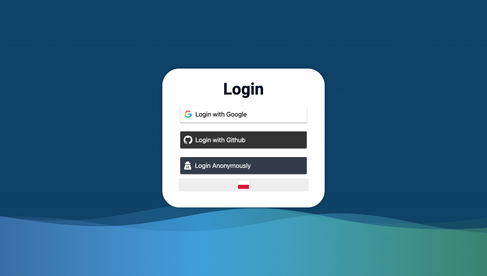
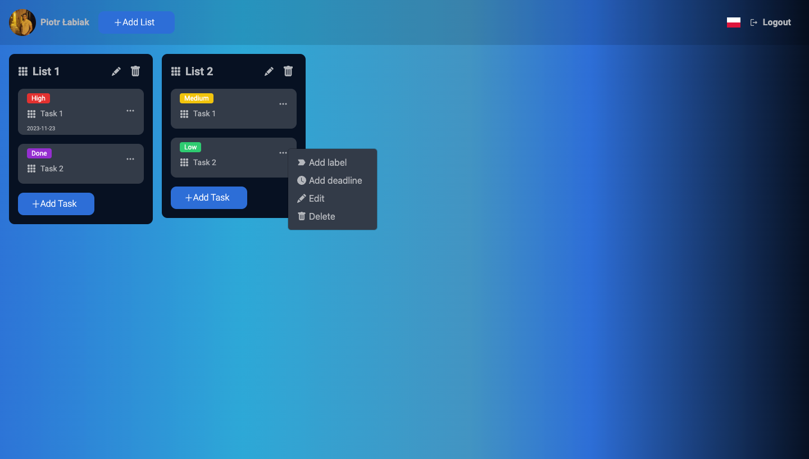

# TaskManager

Welcome to TaskManager! This simple project aims to provide a basic task management solution. Whether you prefer logging in with Google, GitHub, or anonymously, TaskManager has got you covered. Additionally, you have the flexibility to switch between English and Polish languages for your convenience. Feel free to explore and use it as you see fit!

## Features

### Authentication
- **Google Login**: Easily log in using your Google account.
- **GitHub Login**: Alternatively, you can log in using your GitHub credentials.
- **Anonymous Login**: Don't want to connect your social accounts? No problem! You can use TaskManager anonymously.

### Multilingual Support
- **English/Polish**: Choose between English and Polish languages to customize your experience.

### Task and List Management
- **Task Creation**: After logging in, users can create lists and add tasks to them effortlessly.
- **Labeling Tasks**: Assign labels to your tasks for better organization.
- **Deadline Management**: Set deadlines for your tasks to stay on track.

### Drag-and-Drop Functionality
- **Effortless Organization**: Move tasks and lists seamlessly using drag-and-drop functionality for a smoother workflow.

## Screenshots

### Login Page

### Home Page

## Getting Started

To get started with TaskManager, follow these simple steps:

1. Clone the repository.
2. Install dependencies using `pnpm install`.
3. Set up a Firebase app with authentication and Firestore database.
4. Copy and paste your credentials into the `firebase.js` configuration file.
5. Run the application using `pnpm run dev`.

## License

This project is licensed under the [MIT License](LICENSE).
